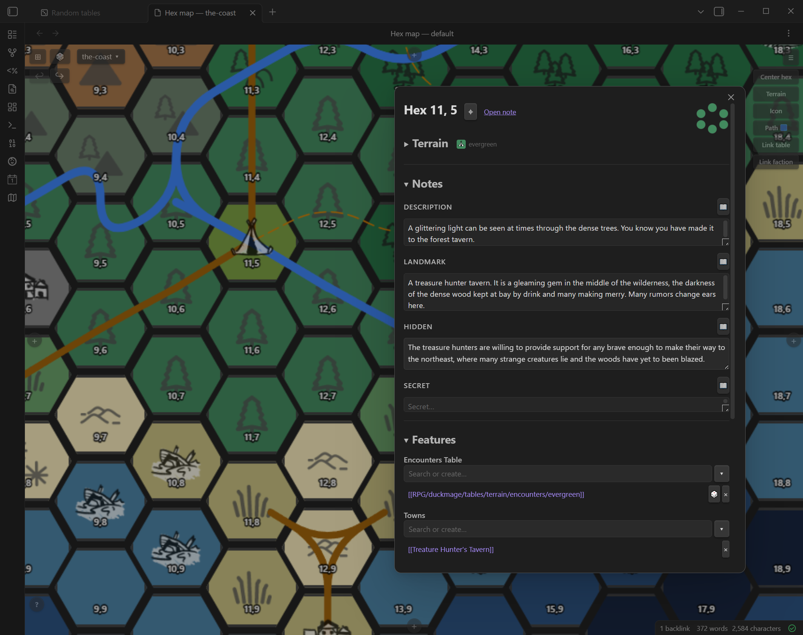

# Hexmap World Creator

A hexmap maker and hexcrawl toolbox for Obsidian, for any TTRPG. Each map is a note in your vault, and any hex can get its own Markdown note — attach locations, paths, and prose directly to the geography of your world.


---

## What it does

Hexmap World Creator gives you an interactive hex grid that lives inside Obsidian. Paint terrain, draw roads and rivers, link town and dungeon notes to individual hexes, overlay faction and geographic region fills, drill into submaps, roll random encounters, and browse everything in a spreadsheet view — all without leaving your vault. Your map and every hex note are plain Markdown files you own.

### Hex editor

Click any hex to open the editor: set terrain, override the icon, link Towns, Dungeons, Features, Quests, Factions, and Encounters Tables, and write freeform notes (Description, Landmark, Hidden, Secret, plus Weather and Hooks & Rumors). Roll a table from the editor and **Add to this hex** puts the result in the section you pick. Link a submap to the hex and click the center dot in the hex flower to dive into it. There is no Save button: the editor saves a moment after you stop typing ("Saving shortly…", then "✓ All changes saved"), and closing it saves straight away.



### Terrain painting

Switch to the Terrain tool, pick a colour from your palette, and drag across hexes to paint. Choose a 1×, 3×, or 7× brush for broad strokes. An eyedropper lets you sample an existing hex's terrain as your active brush.


### Path drawing

Click the Path button to open the path picker. Select any defined path type — road, river, or anything you've created — then click hexes to lay down a chain, or turn on **Auto-route** and click a start and an end to let the path find its own way around impassable terrain. Each type has its own colour, width, line style (solid / dashed / dotted), and routing mode (through hex centres, meandering between them, or tracing hex edges). Edit types at any time from the map toolbar.


### Random tables

A two-panel view for rolling and managing weighted random tables. The left panel shows your tables folder as a collapsible folder tree — the same structure as your vault. Click any table to load it, hit Roll to highlight a result, and see percentage odds for every entry. Create new table files from the toolbar, edit entries inline, and chain tables together into multi-step **workflows** that fill a template note with rolled results.


### Hex table view

A scrollable spreadsheet of every hex note — one row per hex, columns for terrain, description, towns, dungeons, features, quests, factions, encounters table, and all the freeform sections. Click any cell to edit it in place. Filter by map, terrain type, or the presence of specific link types. The ◎ button jumps the map view to that hex's position.


### Faction and region overlays

Paint translucent colour fills over hexes to show political control or geographic regions. Adjacent hexes of the same faction or region merge into smooth blobs with a rendered legend. Toggle overlays from the map overlay panel; overlay state is saved per map.

### GM layer

Toggle the GM layer from the overlay panel to switch between player-facing and GM views. When active, Hidden and Secret sections in the hex editor expand automatically, and hexes with hidden or secret content are highlighted on the map.

---

## Manual Installation

1. Download `main.js`, `manifest.json`, and `styles.css` from the [latest release](https://github.com/sbuffkin/hexmaker/releases/latest).
2. In your vault, create the folder `.obsidian/plugins/hexmaker/`.
3. Copy the three downloaded files into that folder.
4. In Obsidian, open **Settings → Community plugins**, find **Hexmap World Creator** in the list, and enable it.

---

## Getting started

After enabling the plugin, a **setup wizard** opens. It asks what you'll map (a fantasy world, space, or both), where your world folder lives, and makes your first map. That last step can **generate the terrain** for you (Overland for a world map, Star scatter for a star sector), with a preview and a re-roll button, or start blank for painting by hand. It also creates the terrain description and encounter tables. That's all you need to start.

To set things up by hand instead (or later):

### 1. Set your world folder
Open **Settings → Hexmap World Creator** and enter a root folder name in **World folder** (e.g. `RPG/world`). This is the base for all other folders.

### 2. Generate folders
Click **Generate folders**. This fills in the hex, towns, dungeons, tables, and other folder settings with sensible defaults under your world folder and creates them in your vault. Any field you've already filled in is left untouched.

### 3. Open the Hex Map
Click the map icon in the left ribbon (or use the command palette: **Hexmap World Creator: Open hex map**). You'll be prompted to create your first map — give it a name, choose its size, and pick a terrain palette.

### 4. Generate terrain tables
Once your folders are set, go back to **Settings → Hexmap World Creator** and click **Generate terrain tables & hex links**. This creates a description and encounters table file for every terrain type and links them into any existing hex notes. It's safe to run again at any time.

You're ready to start mapping.

---

## Features

### Hex Map view
An interactive hex grid rendered as an Obsidian panel.

- **Left-click** a hex to open the hex editor.
- **Right-click** a hex for its menu: centre on it, open its note, enter / create / link a submap, link a table, swap hexes, create a token here, clear terrain.
- **Pan** by clicking and dragging with the left or middle mouse button.
- **Zoom** with the scroll wheel.
- **Expand** the grid with the `+`/`−` buttons at the map edges.
- **Go to hex** (`⌖` button in the toolbar) — enter coordinates to centre the view on a specific hex.
- **Undo / Redo** (`↩` / `↪` buttons) — step back or forward through terrain and icon paint operations.

### Maps
Organise your world into multiple named hex maps, each stored as a subfolder under your hex folder. The active map name is shown in the top-left of the toolbar as a dropdown button.

- **Switch** — click the map name button to open the maps panel, then click any map in the list to make it active. The list is a tree: submaps sit under the map they came from, and neighbouring regions are grouped together. Click ▸ / ▾ to fold a branch; with more than 10 maps a search box finds a map by name.
- **Create** — enter a name, choose a grid size and terrain palette, then click Create. The map keeps the name as you typed it ("Barony of Saltmere"); its folder and map note use a lower-case, dashed version (`barony-of-saltmere`).
- **Name** — change the name shown everywhere. Nothing moves on disk. The name is stored as `display-name:` in the map note.
- **Folder name** — rename the folder itself; its hex notes and map note move with it and links to the map are updated.
- **Delete** — removes the map and moves all its hex notes to the trash.
- **Weather and rumours** — the tables the hex editor rolls for Weather and Hooks & Rumors on this map (stored in the map note as `weather-table` and `rumors-table`).
- **Terrain theme** — assign a terrain type to a map. The swatch appears next to the map name in the switch list and sets the colour of the submap center dot when this map is linked as a submap from a parent map.
- **Back** (`← Back` button) — returns to the previously active map after following a submap link.

### Generators
Maps can be generated instead of painted hex by hex. When you create a map (**Maps → New map…**, or the setup wizard's first map) or a submap (right-click a hex → **New submap…**), pick a generator and preview it before creating. A new map starts on Overland (Star scatter for space-only setups); pick Blank to paint it all yourself. **More** under the form sets the starting coordinates, stagger and a background image (picked from the vault or dropped from your computer).

- **Overland** — a region from noise: seas, coasts, plains, forests, hills, mountains. Set water %, climate, and which side the sea is on.
- **Region detail** (submaps) — zooms into the parent hex: its terrain fills the map and each neighbouring hex shapes the matching edge, with that neighbour's own terrain (evergreen next to evergreen) along it.
- **Star scatter**, **Orbits**, **Planet surface** (space maps) — a star sector, a star system around its star, and a planet's surface. Orbits places moons (the *moon* terrain) beside their planets; a system with a planet always has at least one.
- **Biomes and presets** (Advanced) — Grassland, Temperate forest, Taiga, Tundra, Alpine, Badlands, Savanna, Jungle, Swamp, Karst, River delta, Coastal fjord, Archipelago, Deep forest, Valley and Volcanic. They place terrain by terrain *type*, so they work with Limited, Expanded, or your own palette (as long as its terrains have types). On Limited, terrain kinds it lacks fold into the nearest one (marsh becomes grass, peaks become mountain). Streams and trails are drawn as your River and Road path types if you have no stream or trail type.
- **Learned generators** — made in the **Terrain generator** view (command palette: **Hexmap World Creator: Open terrain generator**) by learning from maps you've already painted, or by blending several.

**Neighbouring maps.** In **Maps → New map…**, **Next to** makes the new map a region beside an existing one (same size and palette, lined up hex for hex); **Properties → New region here…** opens the form already placed. The generators marked *Continues … edge* (Overland and learned generators) carry the neighbour's terrain on across the shared border, and the preview shows the neighbour's edge faded around the new map. Region detail is only offered for submaps, since it zooms into a parent hex.

**Shared coordinates.** Neighbouring regions number their hexes on one grid, so a hex number is unique across the world: the map east of a 20-column map that starts at 0 starts at column 20. The placement note shows the range ("Hexes 20, 0 to 39, 13"). Maps joined before this, or two existing maps linked in **Properties → Neighbouring regions**, keep their own numbers; nothing is renamed. Next to the map button, the neighbouring regions show as crumbs named by side ("Thornwood ▾  East: Cole's Ford"); click one to go there. Inside a submap, the crumbs offer its parent's neighbours ("beside Thornwood: South: Cole's Ford"), one click away. A road or river that ends on a region's edge, next to the end of the neighbour's path of the same type, is drawn on to the shared edge on both maps so they join.

Generators only change hexes when a map is created or regenerated; you can always repaint by hand afterwards.

### Hex editor (click a hex)
A modal for editing a hex note without leaving the map.

- **Name** — give the hex a name ("Glass Wastes"). It shows on the map under the hex's icon, in the hover text and in the hex table, and is stored in the map note, so a hex doesn't need a note to have one. When the hex has a note, the name is also added to the note's `aliases`, so the quick switcher, search and `[[links]]` find the note by name (the file stays `x_y.md`). Renaming swaps that alias; aliases you added yourself are kept.
- **Terrain picker** — select the terrain type for the hex from the map's palette.
- **Icon override** — override the default terrain icon with any icon in your icons folder. Icon pickers have **All / Terrain / Custom** tabs (plus **Space** when space maps are on); **Custom** holds the images in your icons folder.
- **Submap link** — link another map to this hex. The hex flower widget shows a center dot coloured by the linked map's terrain theme. Click the dot to navigate directly to that map.
- **Towns / Dungeons / Features / Quests / Factions** — link existing notes from their configured folders, or create a new note by name. Linked items are clickable and open in a new tab. Each entry has a remove button.
- **Encounters Table** — link random table files to a hex. Clicking a linked table opens the Random Tables view with that table pre-selected.
- **Notes sections** — Description, Landmark, Hidden, Secret — inline text areas; a 📖 button rolls the section's table where one exists.
- **Weather and Hooks & Rumors** — folded under Notes. 🎲 rolls the map's weather or rumours table (set in **Maps → Properties → Weather and rumours**); ⋯ picks a different table for one hex. With neither set, the starter `weather.md` / `rumors.md` in your tables folder is used.
- **Add to this hex** — any roll made from the editor (encounter tables, section tables) can be added to a section of this hex's note, chosen from a list (the section you rolled from comes first). The note is created if the hex has none. **Copy** is always there too.
- **Open note** link next to the hex coordinates opens the full note in a new tab.

### Random Tables view
Open via **Command palette → "Hexmap World Creator: Open random tables"** or the 🎲 button in the hex map toolbar.

A two-panel view for managing and rolling on random tables.

- **Left panel** — shows all `.md` files in the configured Tables folder as a collapsible folder tree. Click a folder header to expand or collapse it. Click a table to load it. The filter input at the top narrows results and temporarily expands all folders. **+ New** creates a file from the default template.
- **Right panel** — shows the table's entries with odds (percentage or die range). **Roll** button highlights the winning row and shows the result. The result is editable before use. Roll history shows the last 5 results.
- **Change die** dropdown — updates the `dice:` frontmatter and recalculates die ranges.

### Workflows view
Open via the Workflows tab in the Random Tables panel.

Chain multiple table rolls together into a filled template note.

- **Create a workflow** — define steps (each step rolls a table N times), a template with `$placeholder` variables, and a results folder.
- **Roll a workflow** — each step shows a dropdown and a Roll button. The template fills in live as you roll. Save the result as a new vault note.

### Terrain tables & hex linking
Each terrain type has two auto-generated table files: `{terrain} - description.md` and `{terrain} - encounters.md`, stored under `{tablesFolder}/terrain/`. With only the Space map type on, tables are made for the space palettes' terrains only, not the fantasy ones.

> ⚠️ **Configure all folder settings before clicking Generate.** The Generate button (Settings → Hexmap World Creator → Generate world data) creates the terrain table files and links each hex note's terrain encounters table into its Encounters Table section. It is safe to run multiple times.

### Drawing tools (toolbar)
Click the **pencil** icon on the right edge of the map to open the drawing tools panel. **Right-click** off a hex (or click the active button again) to exit any tool. Tools that link or paint items show a **Remove** option at the start of the picker — selecting it enters erase mode so you can click hexes to remove that layer.

| Tool | Left-click | Right-click (on hex) |
|------|------------|----------------------|
| **Terrain** | Paint terrain (drag to paint multiple hexes) | — |
| **Icon** | Paint an icon override | — |
| **Path** | Add hex to the active path chain (or, with Auto-route, pick the start and then the end) | Remove hex from chain |
| **Link table** | Add the selected random table to the hex's Encounters Table section | — |
| **Link submap** | Link the selected map to the hex as a submap | Remove submap link |
| **Factions** | Paint a faction colour (drag to paint multiple hexes) | Erase faction from hex |
| **Regions** | Paint a geographic region colour | Erase region from hex |
| **Token** | Open the token creator, then click a hex to place the new token | Cancel placement |

**Terrain painter extras:**
- Clicking the Terrain button always reopens the palette so you can switch colours mid-session.
- **Pick** (eyedropper) — samples the terrain from the next hex you click and sets it as the active brush.
- **Clear** — paints the "no terrain" state.
- **Brush size** — paint 1×, 3×, or 7× hex radius at once.

**Path tool:** Click the Path button to open the path type picker. Select a type to start drawing, or switch to edit mode to create, rename, recolour, or delete path types. Each path type has a name, colour, line width, line style (solid / dashed / dotted), and routing mode:

- **Through** — smooth Bezier curve through hex centres.
- **Meander** — gentle curve through the midpoints between hex centres (good for rivers).
- **Edge** — traces strictly along the hex polygon boundary lines between hexes.

**Auto-route:** the picker (and the bar at the top of the map while drawing) switches between **Hex by hex** and **Auto-route**: in the picker, choose how to draw (step 1), then the path type (step 2). With Auto-route, click a start hex and then an end hex: the path takes the shortest way inside the map, around impassable terrain, keeping close to the straight line between the two, and then carries on from that end, so you can route leg by leg. Rivers (and other path types that cross impassable terrain, or are named river, stream or creek) wind gently instead of running straight. A route continues an existing path only when its start is that path's end; starting anywhere else (such as the first hex of another road) makes a new path, and existing paths are never changed. The result is an ordinary path: right-click hexes to remove them, or switch back to hex by hex to extend it.

- **Impassable terrain** — set per terrain in the palette editor (Impassable column) or the terrain editor. Water types (ocean, trench, shallows…) are impassable unless you untick them. A palette with no impassable terrain says so in the bar.
- **Per path type** — each path type has **Avoid impassable terrain** (in its editor). Roads avoid water; rivers don't (they're off by default for river-like names).
- **Cross impassable** — tick it in the bar to let one route go through anyway. If no route exists the map tells you, and suggests this or changing which terrains are impassable.

**Link table / Link submap:** Clicking either button opens a picker. For tables, the picker shows your tables folder as a collapsible folder tree with a filter input. For submaps, the picker shows a filterable list of your maps with their terrain theme swatches. Once a table or map is selected, click any number of hexes to link it. The hex flashes a ripple animation on each successful link.

### Overlays (faction and region)
Toggled from the **layers** panel on the right edge of the map.

- **Faction overlay** — paint a faction colour on any hex. Adjacent hexes of the same faction merge into smooth filled blobs with a coloured border. A legend lists each active faction. Edit faction names and colours from the overlay panel. Faction data is stored as wiki-links in each hex note's `### Factions` section.
- **Region overlay** — paint a geographic region colour on any hex. Regions render as filled blobs with a scaled label centred on the blob. Region data is stored in the map note (see [Map notes](#map-notes)).
- Both overlays can be shown simultaneously and toggled independently.
- Additional toggles: **Show terrain icons**, **Show icon overrides**, **Show paths**, **Show tokens**, **GM layer**.
- **Labels** group: **Coordinates**, **Hex names** and **Token names** (all on by default). With token names off, a token's name still shows while you hover it. Hex names stay inside their hex and clear of its badges: a long name shrinks and wraps at spaces onto up to three lines (words are never split; an ellipsis cuts a name that still doesn't fit; the hover shows it whole). Names grow and shrink with the zoom like the rest of the map, and their colour follows the terrain (dark text on light terrain such as snow, light text on dark terrain).
- **Show link badges** (on by default) — a coloured icon badge at a hex's right side for each kind of link in its note: towns, dungeons, features, quests, factions. **S / M / L** beside the toggle sets their size (S by default; S is small and stays inside the hex, M and L sit on the hex's right edge so they stand out). Badges sit above hex names and coordinates, and names make room for them. The legend lists the badge kinds shown on the map. Hovering the hex names the linked notes ("Gullmouth · beach · hex 6, 6 · Town: Gullmouth"). Your hex icon stays as it is. The ▸ next to the toggle picks which kinds show. Saved per map.
- Opening or closing the layers panel (or the drawing tools) never moves the map; the panel may cover a few hexes at the right edge.
- **Show legend** (on by default) — a terrain legend in the map's bottom-right corner listing only the terrains used on this map. **S / M / L** sets its size; **×** hides it. The new-map and generator previews show the same legend. Size and visibility are remembered.

### GM layer
Toggle from the overlay panel. When active:

- Hexes with Hidden or Secret content are visually highlighted.
- The hex editor automatically expands the Hidden and Secret sections when opened.

GM layer state is stored per map and persists across sessions. New maps start with it off; maps made before this keep it on until you turn it off.

### Tokens
Place movable tokens on the map — useful for tracking party position, NPCs, or any note-backed marker. Each token's name shows under it (turn this off with **Labels → Token names** in the layers panel; the name still shows on hover).

**Creating a token:**
1. Click the **Token** button in the drawing tools panel.
2. Fill in the token form: choose a note (existing or new), icon, shape (circle / square / hexagon), fill colour, and border colour.
3. Click **Next: place on map**, then click any hex to place the token there.

**Interacting with tokens:**
- **Click** a token to open the hex it stands on, just like clicking the hex.
- **Drag** a token to a different hex to move it. The target hex is highlighted as you drag.
- **Right-click** a token for its menu: **Token info** (the linked note title and hex position, with "Jump to hex" and "Open note"), edit its properties (icon, shape, colours), or remove it from the map.

Token state is stored in the linked note's frontmatter (`token`, `token-hex`, `token-map`, `token-icon`, `token-shape`, `token-color`, `token-border`, `token-visible`). Tokens follow the map they were placed on and persist with the note.

### Hex table view
Open via **Command palette → "Hexmap World Creator: Open hex table"** or the ⊞ button in the hex map toolbar.

A scrollable reference table of every hex note, with one row per hex and columns for all sections.

- **Coordinates column** — click to open the hex note. A named hex shows its name beside the coordinates.
- **Terrain column** — click to open the terrain picker.
- **Town / Dungeon columns** — click an empty cell to add a link (pick existing or create new); click a populated cell to open the note (or a navigation list for multiple links).
- **Text section columns** (Description, Landmark, etc.) — click any cell (including empty ones) to open an inline editor. Saves directly to the section in the hex note, creating the note and section if they don't exist yet.
- **Resize columns** by dragging the border between column headers.
- **Filter** by map, terrain type, or the presence of specific link types using the toolbar controls.
- **Refresh** button reloads all data from disk.

### Export
Export a map for printing or for your players.

- **Where:** the command **Hexmap World Creator: Export current map…** (any map; it starts on the one open in the hex map view), or the map-name button in the hex map toolbar → **Export** tab. Both show the same form.
- **Formats:** **Export PNG** (an image of the map), **Export PDF with reference table** (the map, then a table per section listing each hex's linked notes and the start of its Description), and **Export hexcrawl manual (PDF)** (a printable gazetteer with legend, encounter tables and keyed hexes).
- **Options:** file name; **On the map**: coordinates, icons, paths, hex names, tokens (with their names), link badges, legend (the terrains used and the badge kinds, beside the map), faction overlay, region overlay; output size. The ticks start from what the map view shows (the overlays start off), and the form remembers your last file name, ticks and size for each map. Labels near the edge are kept inside the image. Roads and rivers are drawn bolder than on screen, scaled to the output size, and badges use the map's badge size. **PDF table columns** picks which columns the reference table prints (name, terrain, towns, dungeons, features, quests, factions, encounters, description), so you can cut a handout down to what players should see. **Hexcrawl manual** holds the player-version switch and lets you leave out the legend, encounter tables, factions and regions, or index. The form lists the exact file names it will write; files go to the export folder and open in a tab. Exporting again under the same name replaces the file (the notice says "Replaced …") and refreshes the tab already showing it.
- **What players see:** the PNG never includes GM-layer icons, hidden tokens or any note text (Description, Landmark, Hidden, Secret), so it is safe as a handout. The faction and region overlays show their names when ticked; leave them off if those are secret. The PDF's table has no Hidden or Secret text. The hexcrawl manual is the full GM book unless you tick **player version**, which leaves out Hidden and Secret.
- A single note or hex can also be exported: **Hexmap World Creator: Export current note to PDF**, **… to Markdown**, **Export current hex (structured PDF / Markdown)**, or the **Export** link in the hex editor.

### Commands
Every command, as it appears in the command palette:

| Command | What it does |
|---------|--------------|
| **Hexmap World Creator: Open hex map** | Opens the hex map view. |
| **Hexmap World Creator: Open hex table** | Opens the spreadsheet of hex notes. |
| **Hexmap World Creator: Open random tables** | Opens the random tables and workflows view. |
| **Hexmap World Creator: Open terrain generator** | Opens the terrain generator (learn, blend and run generators). |
| **Hexmap World Creator: Open palette editor** | Opens the terrain palette editor. |
| **Hexmap World Creator: Go up to parent map** | From a submap, back to the map it belongs to. |
| **Hexmap World Creator: Go back to previous map** | Returns to the map you were on before. |
| **Hexmap World Creator: Export current map…** | Opens the map export form (PNG, PDF, hexcrawl manual). |
| **Hexmap World Creator: Export current note to PDF** | Exports the open note as a PDF. |
| **Hexmap World Creator: Export current note to Markdown** | Exports the open note as Markdown. |
| **Hexmap World Creator: Export current hex (structured PDF / Markdown)** | Exports the open hex note with its sections. |
| **Hexmap World Creator: Export current workflow with rolled samples** | Exports the open workflow with example rolls. |

---

## Settings

Open **Settings → Hexmap World Creator** to configure:

| Setting | Description |
|---------|-------------|
| **World folder** | Root folder for world notes (used by the Features file picker). |
| **Hex folder** | Folder where hex notes are stored, e.g. `RPG/world/hexes`. Each map becomes a subfolder here. |
| **Towns folder** | Scopes the Towns picker to a specific folder. |
| **Dungeons folder** | Scopes the Dungeons picker to a specific folder. |
| **Quests folder** | Scopes the Quests picker to a specific folder. |
| **Factions folder** | Scopes the Factions picker to a specific folder. |
| **Tables folder** | Folder for random table files. Terrain tables are created in a `terrain/` subfolder here. |
| **Workflows folder** | Folder for workflow definition files and their templates. |
| **Default die** | Die size used when creating new table files (d4–d100). |
| **Icons folder** | Folder containing `.png` icon files available as custom terrain/hex icons. |
| **Template path** | Path to a custom hex note template. Supports `{{x}}`, `{{y}}`, `{{title}}` and `{{map}}` placeholders. Leave blank to use the built-in template. |
| **Hex gap** | Gap between hexes in pixels. |
| **Hex orientation** | `flat` (default) or `pointy` top hex style. |
| **Path types** | Named path types used by the Path drawing tool. Each type has a name, colour, width, line style, and routing mode. Manage them from the Path button on the hex map toolbar. |
| **Palettes folder** | Folder holding one note per terrain palette (default `{world folder}/palettes`). |
| **Terrain palettes** | Named palettes of terrain types. Each palette has a name and a list of terrain entries (name, colour, optional icon and icon tint). Palettes are assigned to maps at creation time. Edit palette contents from the terrain tool on the hex map, or as a table in the palette's note — copy a palette note into another vault's palettes folder to share it. **Add palette** offers built-in presets: *Expanded* (the default fantasy overland palette on new installs; installs from before it keep their first palette as the new-map default: coasts, wetlands, forest and mountain kinds; matches the generators) and *Limited* (fewer, simpler terrains; quicker to paint), plus *Space - Sector* (star charts, one hex per parsec; adds Jump route and Trade route path types) and *Space - System* (stars, planets, belts, stations) for sci-fi games such as Traveller. New-map palette menus list uninstalled presets too. |
| **Generate** | ⚠️ Configure all folders first. Creates missing terrain table files and links each hex's terrain encounters table into the hex note. |

---

## Map notes

Each map has one **map note** at `{hexFolder}/{map}/_{map}.md` (e.g. `RPG/world/hexes/Overworld/_Overworld.md`). It holds the map's settings in its frontmatter and a table with one row per hex that has map data: name, terrain, icon, GM icons, region, submap and locked. Hexes with only the map's base terrain (or nothing) have no row. Painting updates the table; you can also edit the table by hand and the map follows. Anything you write in the note outside the "Hexes" and "Paths" tables is left alone.

Older versions kept terrain and the rest in each hex note's frontmatter. The first time this version starts, it moves that data into map notes, keeps a JSON backup in the plugin folder's `backups/`, and replaces those frontmatter fields with a `hexmaker-map:` link to the map note. Note text is never changed or deleted. Older plugin versions on other devices don't read map notes, so update every device that shares the vault.

## Hex notes

Each hex note lives at `{hexFolder}/{map}/{x}_{y}.md` (e.g. `RPG/world/hexes/Overworld/3_7.md`). Hex notes hold descriptions and links, and are created when a hex first gets some (you open it, write in the editor, or link something); painting terrain doesn't create one. Its frontmatter links to the map note:

```yaml
---
hexmaker-map: "[[_Overworld]]"
---
```

**Sections** (used by the editor and table view):

| Heading | Type | Purpose |
|---------|------|---------|
| `### description` | Text | What the party sees and feels |
| `### landmark` | Text | The standout visible feature |
| `### Towns` | Links | Settlement links |
| `### Dungeons` | Links | Dungeon/site links |
| `### Features` | Links | Other points of interest |
| `### Quests` | Links | Active quest links |
| `### Factions` | Links | Faction links (used by the faction overlay) |
| `### Encounters Table` | Links | Random table links (linked to terrain by Generate) |
| `### hidden` | Text | Discoverable with effort |
| `### secret` | Text | Revealed only through investigation |
| `### weather` | Text | Weather notes |
| `### hooks & rumors` | Text | Adventure seeds |
| `### Weather Table` | Link | Optional: this hex's own weather table (instead of the map's) |
| `### Rumors Table` | Link | Optional: this hex's own rumours table |

You can use your own template (configured in Settings). Any `### Heading` that matches a section name will be picked up automatically.

---

## Development

```bash
npm install        # install dependencies
npm run dev        # watch mode — rebuilds main.js on every save
npm run build      # production build (type-check + bundle)
npm run version    # bump version (updates manifest.json and versions.json)
npm test           # run the test suite
```

The built output is `main.js` in the repo root. Obsidian loads this file directly from the plugin folder.

**Reload the plugin after a build:**
```js
// Paste in Obsidian developer console (Ctrl+Shift+I)
app.plugins.disablePlugin('hexmaker');
app.plugins.enablePlugin('hexmaker');
```

### Source layout

```
main.ts                               ← re-exports HexmakerPlugin
src/
  HexmakerPlugin.ts                   ← plugin entry point
  HexmakerSettingTab.ts               ← settings UI
  HexmakerModal.ts                    ← base modal class (makeDraggable, shared behaviour)
  types.ts                            ← interfaces and type constants
  constants.ts                        ← runtime constants and defaults
  frontmatter.ts                      ← map data getters/setters (via the map store) + token YAML
  sections.ts                         ← markdown section read/write helpers
  utils.ts                            ← shared utilities
  defaultHexTemplate.md               ← built-in hex note template
  hex-map/
    HexMapView.ts                     ← interactive hex grid (ItemView)
    HexSidePanel.ts                   ← collapsible side panels (drawing tools, overlays)
    HexEditorModal.ts                 ← hex editor, opened by clicking a hex (Modal)
    MapModal.ts                       ← map management (switch, create, rename, delete, terrain theme)
    SubmapPickerModal.ts              ← link submap to a hex (picker + create)
    TerrainPickerModal.ts             ← terrain palette picker
    TerrainEntryEditorModal.ts        ← edit a single terrain entry
    IconPickerModal.ts                ← icon override picker
    PathPickerModal.ts                ← path type picker
    PathTypeEditorModal.ts            ← edit a single path type
    FolderTreePickerModal.ts          ← table picker (collapsible folder tree)
    FileLinkSuggestModal.ts           ← file picker scoped to a folder
    PainterContextMenu.ts             ← right-click context menu for painter tools
    TokenModal.ts                     ← create/edit a token (icon, shape, colour)
    TokenInfoModal.ts                 ← token info card (jump to hex, open note)
    MapLinkModal.ts                   ← link an existing note to a hex section
    newMapFields.ts                   ← shared new-map form fields (name, size, palette)
  hex-table/
    HexTableView.ts                   ← hex reference table (ItemView)
    HexCellModal.ts                   ← inline cell editor
    HexTerrainPickerModal.ts          ← terrain picker in table view
  random-tables/
    RandomTableView.ts                ← random tables + workflows panel (ItemView)
    FolderTree.ts                     ← buildTree + renderFolderTree shared utilities
    RandomTableModal.ts               ← inline roll modal
    RandomTableEditorModal.ts         ← edit table entries
    WorkflowEditorModal.ts            ← edit workflow definition
    WorkflowWizardModal.ts            ← execute a workflow
    randomTable.ts                    ← parse/roll/odds utilities
    workflow.ts                       ← workflow parse/serialize utilities
```

### Troubleshooting

- **"Failed to load plugin"** — `main.js` is missing. Run `npm run build`.
- **Viewing logs** — Press `Ctrl+Shift+I` (Windows/Linux) or `Cmd+Option+I` (Mac) to open the developer console.

---

## Third-party libraries

This plugin bundles [MiniSearch](https://github.com/lucaong/minisearch) (© Luca Ongaro, MIT License) for in-memory full-text search.

The space icon pack (`icons/space-*`) uses icons from [game-icons.net](https://game-icons.net) by Lorc and Delapouite (CC BY 3.0), [Material Design Icons](https://pictogrammers.com/library/mdi/) (Apache 2.0), [Tabler Icons](https://tabler.io/icons) (MIT), and [Kenney Simple Space](https://kenney.nl/assets/simple-space) (CC0). Full per-icon credits and licence texts are in [`icons/CREDITS.md`](icons/CREDITS.md).
